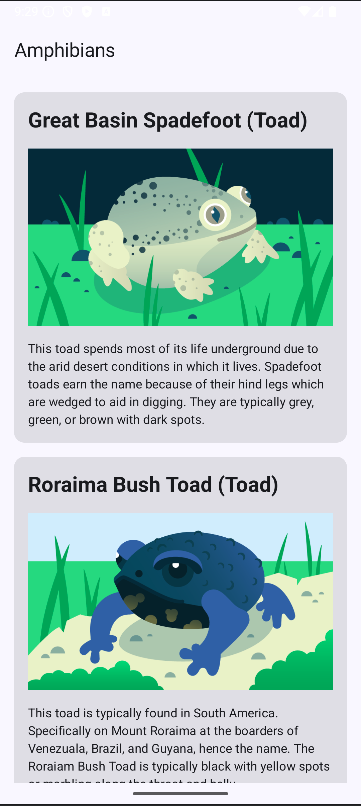

# Amphibians App

A simple Android application built with Kotlin and Jetpack Compose that displays information about various amphibian species fetched from an API.

## Features

- **Scrollable list** of amphibian species
- **Clean, organized layout** with name and type first, then image, followed by description
- **Network data fetching** from REST API
- **Error handling** with retry functionality
- **Material 3** design components

## Screenshot

## Technologies Used

- Kotlin
- Jetpack Compose
- Retrofit for API calls
- Coil for image loading
- MVVM Architecture

## API Source

Data is fetched from: https://android-kotlin-fun-mars-server.appspot.com/amphibians

## Setup

1. Clone the repository
2. Open in Android Studio
3. Build and run on an emulator or physical device

Developed by Artem Guz
